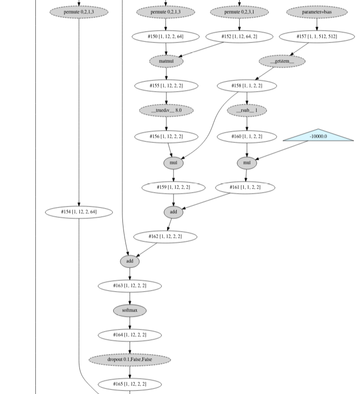
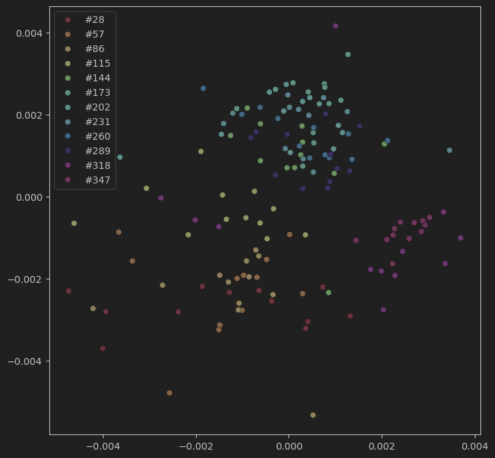

# fMRaI

An explainability and interpretability framework for understanding deep neural networks.

In pursuit of this endeavor, this framework provides a way to **dynamically instrument any\* PyTorch model** and access its full computation graph and intermediate activations.

On top of this, fMRAi provides a set of tools for analyzing and visualizing the model's behavior, including:
* Transformer attention head clustering and analysis
* Key-value memory analysis (started)
* and in the future, more! (see future steps at the end of this readme)

**NOTE**: This project is currently very much a work in progress, and is in a very early state right now.

## Installation

```
pip install fmrai
```

## Implemented Features

### Instrumentation

fMRAi provides a general framework for instrumenting deep neural networks.

Here's how to instrument a hugging face model and obtain its computation graph (unlike autodiff graph, this graph contains tensors, with all intermediate activations):
```python
from fmrai.instrument import instrument_model
from fmrai import fmrai

model = ... # some hugging face model

with fmrai() as fmr:
    m = instrument_model(model)

    with fmr.track() as tracker:
        with torch.no_grad():
            m(**tokenizer("Hello World", return_tensors="pt"))
            g = tracker.build_graph()

    g.save_dot('graph.dot')
```

After converting to svg with dot, here's part of the graph of GPT1:


### Finding attention & activations

The graph created above can be used to find attention heads:
```python
from fmrai.analysis.structure import find_multi_head_attention

g = ... # graph created in the example above
attention = list(find_multi_head_attention(g))
# attention: List[MultiHeadAttentionInstance]
```

The result is an array of `MultiHeadAttentionInstance`s, which point to the IDs of the tensors containing the attention activations.

Since the same graph is created everytime, we can use these IDs to fetch the activations from subsequent invocations:

```python
m = ...         # m is an instrumented model as shown in the first example
attention = ... # result of computation above

with fmr.track() as tracker:
    with torch.no_grad():
        m(**tokenizer("another sentence", return_tensors="pt"))
        computation = tracker.build_map()
        
# get attention tensors (softmax result) from first layer (index 0)
attention_tensors = computation.get(
    attention[0].softmax_value.tensor_id
)
```

### Attention head clustering analysis

Here's an example of using `AttentionHeadClusterAnalyzer` (one of the available analyzers):

```python
from fmrai.analysis.attention import AttentionHeadClusterAnalyzer

loader = ... # some data loader

with fmrai.fmrai():
    with torch.no_grad():
        m = instrument_model(model)
        # m = model

        # process first batch since atm the first time a computation
        # graph is created it includes model parameters while subsequent
        # times don't (need to fix this)
        first_batch = next(iter(loader))
        m(**first_batch.to(model.device))

        analyzer = AttentionHeadClusterAnalyzer()
        for batch in loader:
            with analyzer.track_batch():
                m(**batch)

        # analyze and plot attention heads!
        analyzer.analyze().plot(figsize=(16, 16))
```

Here's the result for BERT (each color is a layer - 12 heads per layer):


## Future Steps

I hope to implement the ideas of as many papers dealing with explainability and interpretability as possible, and to provide a general framework for doing so.

Currently, the papers being implemented are:
* [What Does BERT Look at? An Analysis of BERT’s Attention](https://arxiv.org/abs/1906.04341)
* [Transformer Feed-Forward Layers Are Key-Value Memories](https://arxiv.org/abs/2012.14913)

Right now the focus is on text-based models, but I hope to expand the framework to other domains.

But while the focus is still on text-based models, I hope to make the framework robust enough to work generically even for huge LLMs like Llama and larger models.

More things I want to add:
* Mechanistic interpretability stuff
* Concept analysis
* Tomography maps
* Comparative analysis (in training time)
* and more!
